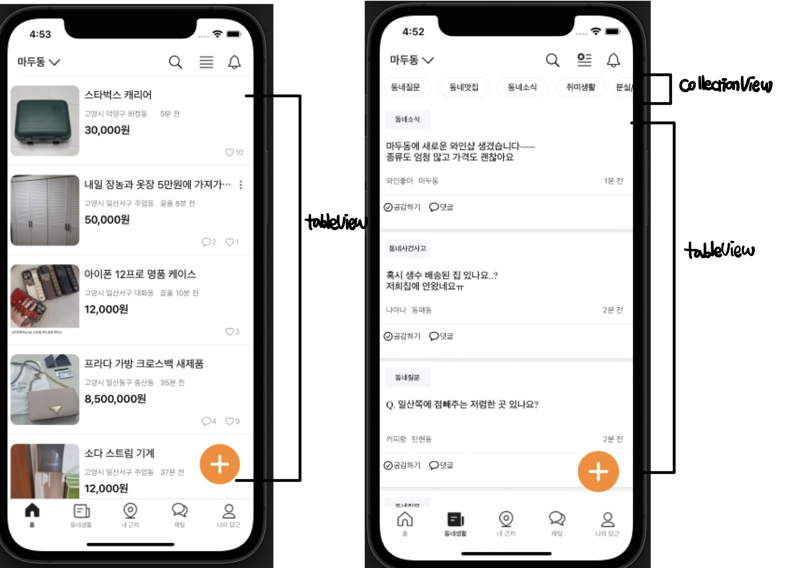
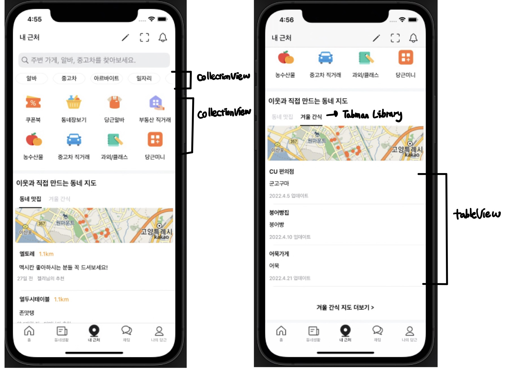
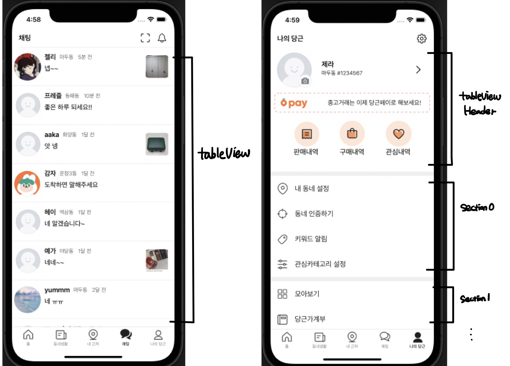
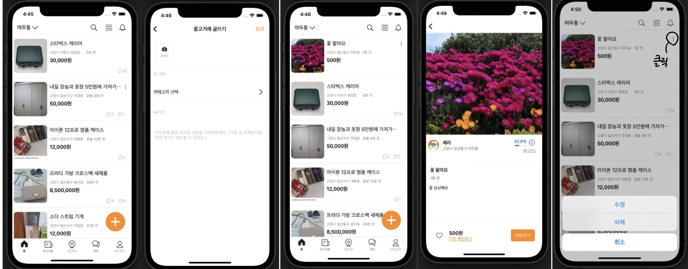

## 📌 구현 화면


## 📌 사용한 tableView와 collectionView








## 📌 CRUD



- 거래글  CRUD 구현
- 내가 올린 글만 삭제, 수정 가능


## 📌 셀 재사용 문제

- 새로운 셀을 추가하면 하트나 채팅이 nil이어도 뜨는 문제 발생 → 셀의 재사용 문제
- 초기화해주는 코드를 작성해서 해결

```swift
func tableView(_ tableView: UITableView, cellForRowAt indexPath: IndexPath) -> UITableViewCell {
    guard let cell = homeTableView.dequeueReusableCell(withIdentifier: "homeCell")
            as? HomeTableViewCell else { return UITableViewCell() }
    
    // 셀의 재사용 -> 초기화
    cell.heartCountLabel.text = nil
    cell.heartImageView.isHidden = true
    cell.chatCountLabel.text = nil
    cell.chatImageView.isHidden = true
}
```

- 멘토님 피드백으로 `prepareForReuse()` 에 수정 완료!

```swift
override func prepareForReuse() {
    // 셀의 재사용 -> 초기화
    heartCountLabel.text = nil
    heartImageView.isHidden = true
    chatCountLabel.text = nil
    chatImageView.isHidden = true
  }
```

## 📌 트러블 슈팅

💡 **tableView 왼쪽 공백 없애기**

```swift
postTableView.separatorInset.left = 0
```


💡 **tableview cell마다 space 주고 싶음**

section을 array의 개수로 주고 footer에 UIView를 달아줌

```swift
extension CommunityViewController: UITableViewDataSource, UITableViewDelegate {
  func tableView(_ tableView: UITableView, numberOfRowsInSection section: Int) -> Int {
    return 1
  }
  
  func numberOfSections(in tableView: UITableView) -> Int {
    return posts.count
  }

	func tableView(_ tableView: UITableView, cellForRowAt indexPath: IndexPath) -> UITableViewCell {
    
    guard let cell = postTableView.dequeueReusableCell(withIdentifier: "postCell")
            as? CommunityPostTableViewCell else { return UITableViewCell() }
    
    if indexPath.section != 0 {
      let footer = UIView(frame: CGRect(x: 0, y: 0, width: view.frame.size.width, height: 5))
      footer.backgroundColor = UIColor(named:"lightGrayColor")
      cell.contentView.addSubview(footer)
    }
	}

}
```


💡 **거래글 create할때는 새로운 모델 생성, update는 그 모델에 data를 바꾸는 방식으로 구현하고 싶음**

- transcaction 프로퍼티 선언하고

  update할때만 모델을 넘겨줘서 nil이면 create, 아니면 update로 구분