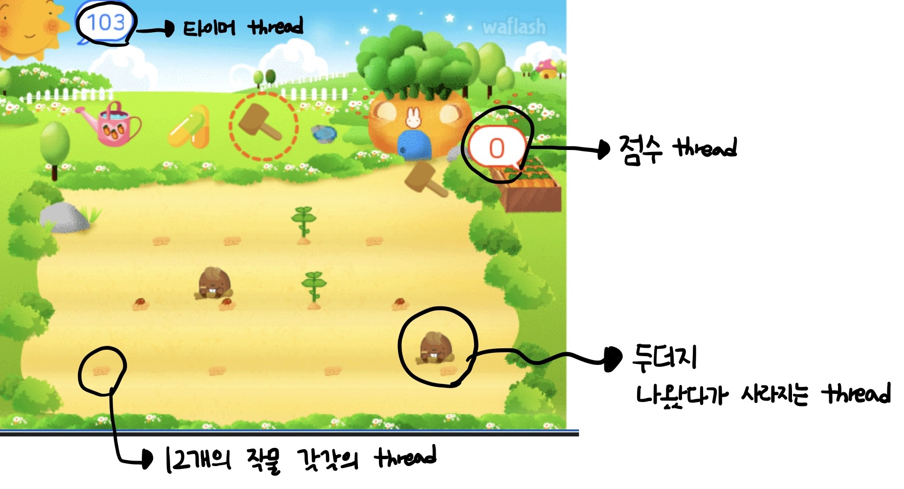

## 📌 구현 화면


## 📌 게임 설명

- 가로모드만 플레이 가능

1. **당근 씨앗 캡슐을 뿌려서 씨앗이 나오게 한다.**
2. **물을 줘서 씨앗을 키운다.** ( 2번 줘야하고 씨앗 → 풀 → 미니 당근 → 큰 당근으로 성장)
3. **당근을 재배한다.**

- **중간 중간에 두더지가 나와서 방해 → 망치로 잡는다.**
- 8**0초가 지나면 게임 종료 → 모은 당근 개수, 잡은 두더지 수로 점수 계산**

## 📌 사용한 스레드

- 타이머

```swift
// 타이머 생성
  private func createTimer() {
    timer = Timer.scheduledTimer(timeInterval: 1,
                                     target: self,
                                     selector: #selector(fireTimer),
                                     userInfo: nil,
                                     repeats: true)
    DispatchQueue.main.async {
      self.timer.fire()
    }
  }
  
  @objc private func fireTimer() {
    timeLabel.text = String(time)
    time -= 1
    if time < 0 {
      timer.invalidate() // 타이머 정지
      let vc = EndViewController()
      vc.modalPresentationStyle = .overCurrentContext
      vc.score = score
      present(vc, animated: false, completion: nil)
    }
  }
```

- 점수

```swift
// 당근 수확
  private func harvest(imageView: UIImageView, index: Int) {
    DispatchQueue.global().async {
      self.score += 1
      DispatchQueue.main.async {
        imageView.image = .none
        self.scoreLabel.text = String(self.score) // 점수 update
      }
    }
    levels[index] = .level0 // level0으로 초기화
    waterings[index] = [false, false] // 1단계, 2단계 모두 물 안준걸로 초기화
  }
```

- 두더지

```swift
// 두더지 생성
  private func createMole() {
    DispatchQueue.global().async {
      for _ in 1...8 {
        usleep(10000000) // 10초에 한 번 두더지 나옴
        DispatchQueue.main.async {
          for _ in 0..<1 {
            let randomNum = Int.random(in: 0...11)
            self.moles[randomNum] = true // 두더지 있다고 체크
            self.playMoleSound()
            self.moleImageViews[randomNum].animate(withGIFNamed: "mole")
          }
        }
      }
    }
  }
```

- 12개 밭 성장 처리

```swift
// level1 -> level2로 성장 처리
  private func level1toLevel2(imageView: UIImageView, index: Int) {
    DispatchQueue.global().async {
      for i in 1...5 {
        DispatchQueue.main.async {
          imageView.image = UIImage(named: "level2_\\(i)") // imageview 바꿔줌
        }
        usleep(1000000)
      }
      self.levels[index] = .level2 // level up
    }
  }
```

- 배경음악 & 효과음 (두더지 나타날 때, 두더지 잡을 때, 물 줄때, 씨앗 뿌릴 때, 수확할 때)

```swift
// 배경 음악 삽입
  private func playBGM() {
    DispatchQueue.global().async {
      guard let url = Bundle.main.url(forResource: "bgm", withExtension: "mp3") else {
        print("error to get the mp3 file")
        return
      }
      self.backgorundPlayer = AVPlayer(url: url)
      self.backgorundPlayer.volume = 0.1
      self.backgorundPlayer.play()
    }
  }
```

## 📌 스레드 관련 이슈

1. **동시성 이슈**

```swift
// level1 -> level2로 성장 처리
  private func level1toLevel2(imageView: UIImageView, index: Int) {
    DispatchQueue.global().async {
      for i in 1...5 {
        DispatchQueue.main.async {
          imageView.image = UIImage(named: "level2_\\(i)") // imageview 바꿔줌
        }
        usleep(1000000)
      }
      self.levels[index] = .level2 // level up
    }
  }
```

- 1초에 조금씩 당근이 자라나는 것을 DispatchQueue안에서 표현하고 싶음
- 처음에 자꾸 최종 성장 이미지만 떠서 봤더니 sync를 쓰고 있었음 `DispatchQueue.global().sync` ->  `DispatchQueue.global().async` 이렇게 수정해서 해결 (`sync` - 동시성 o, `async` - 동시성x)
  

2. **UI처리는 반드시 `main thread`에서만 해야함**

```swift
DispatchQueue.main.async {
          imageView.image = UIImage(named: "level3_\\(i)")
}
```

- UI와 관련된 모든 event가 main thread에 붙기 때문에 반드시 main에서 해야함
  

3. **`DispatchQueue.main.sync` 는 에러**

```swift
DispatchQueue.main.sync { // -> 에러!!
}
```

- deadlock이 나기때문 
